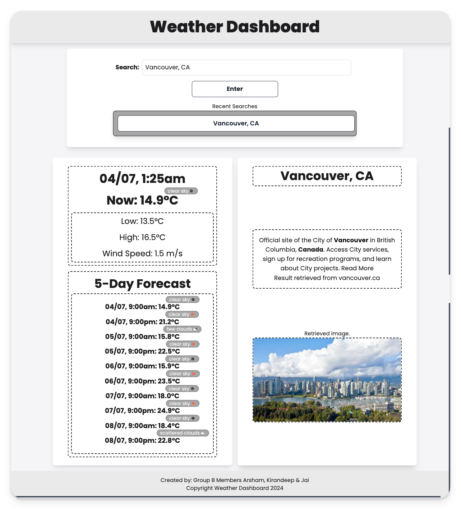
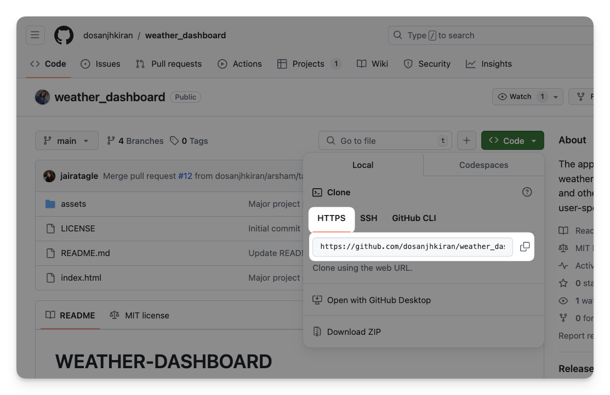

# WEATHER-DASHBOARD
This project was created to produce a sample Weather Dashboard app with travellers and locals in mind. Users can input either the suburb or city name and the country code and instantly receive information and weather details about their chosen location. 

The application will display current weather conditions, a five-day forecast, as well as a description and image of the user-specified location.

Deployed Application URL: [https://dosanjhkiran.github.io/weather_dashboard/](https://dosanjhkiran.github.io/weather_dashboard/)
Github Repository URL: [https://github.com/dosanjhkiran/weather_dashboard/](https://github.com/dosanjhkiran/weather_dashboard/)

## User Story
s a user planning a trip or daily activities, 

I want to easily find accurate weather information, relevant details and an image for better context  about any city by simply entering the suburb name or city name and country code. 

I want to see and receive detailed weather information for today, including the current temperature, high and low temperatures. 

I want a 5-day weather forecast, including the current temperature, high and low temperatures to help me plan ahead. 

I want the information to be presented in a clean, easy-to-read format without unnecessary distractions, ensuring that I can quickly get the updates I need.

## Acceptance Criteria
GIVEN the weather data fetched from the API, 
WHEN the data includes weather conditions, 
THEN the corresponding weather icons are displayed on the webpage. 
AND the icons are accurate and visually representative of the weather conditions. 

GIVEN the CSS file, 
WHEN I view the webpage, 
THEN I can see a well-styled layout with consistent fonts, colors, and spacing. 
AND the webpage should include styles for:
- Header and navigation
- Current weather section
- Five-day forecast section
- Search bar
- Footer

GIVEN the header and navigation, 
WHEN I view the webpage, 
THEN I can see a styled header with a clear title and navigation links. 
AND the header should have a background color, appropriate padding, and font styles.

GIVEN the current weather section, 
WHEN I view the webpage, 
THEN I can see a styled section with temperature, humidity, wind speed, and weather description. 
AND the section should include an appropriate layout, spacing, and weather icon.

GIVEN the index.html file, 
WHEN I view the HTML structure, 
THEN I can see semantic elements such as header, main, section, and footer. 
AND I can see placeholders for current weather, five-day forecast, and search functionality.

GIVEN the JavaScript file, 
WHEN the page loads, 
THEN the script fetches current weather data from the API for a default location. 
AND the weather data is displayed on the webpage (temperature, humidity, wind speed, and weather description).

GIVEN the search bar on the webpage, 
WHEN I enter a city name or ZIP code and submit the form, 
THEN the script fetches weather data for the specified location. 
AND the weather data is displayed on the webpage.

## Installation
The project can be installed by downloading the repository into a zip file, opening it in a code editor such as VS Code, and viewing all HTML, CSS, and JavaScript files. Another option is to clone the repository using the git clone terminal command with the copied URL.

## Usage
The project can be viewed by opening the index.html file in your browser. Furthermore, you can inspect the code using Google Chrome Dev Tools. Head to the `Application` tab > `Local Storage` to view all that is saved within the **searchHistory** local storage after submitting a search query.

## License
MIT License
